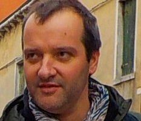

# pilotage de la mission science ouverte de l'université

 
 Mickael Képénékian, Chargé de la documentation et de la science ouverte

# membres du service ARDEL

 | responsable du service ARDEL
 | gestionnaire portail HAL archive ouverte Rennes 1
 | gestionnaire accès documentation électronique
  | formations, aide données de la recherche et plan de gestion des données
